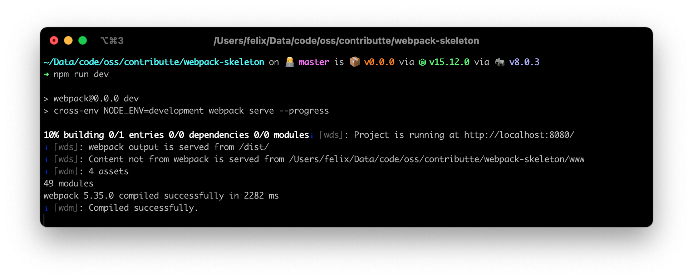
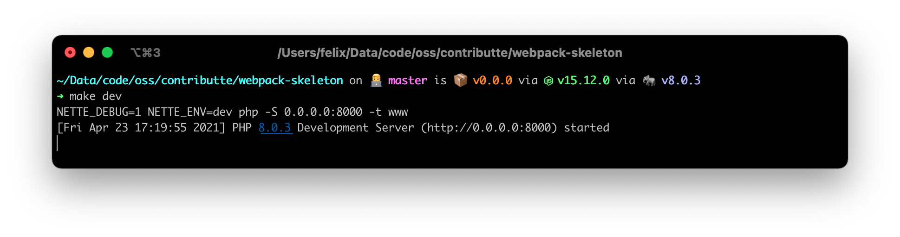
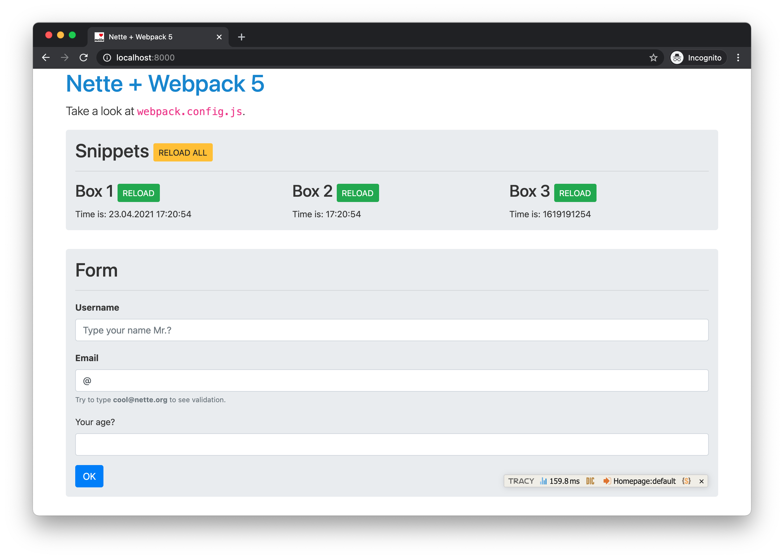

# Webpack skeleton

A Nette application skeleton with Webpack 5, Tailwind CSS, and Vue support.


<p align="center">
  <a href="https://github.com/contributte/webpack-skeleton/actions"></a>
  <a href="https://codecov.io/gh/contributte/webpack-skeleton"></a>
  <a href="https://packagist.org/packages/contributte/webpack-skeleton"></a>
  <a href="https://packagist.org/packages/contributte/webpack-skeleton"></a>
</p>
<p align="center">
  <a href="https://packagist.org/packages/contributte/webpack-skeleton"></a>
  <a href="https://github.com/contributte/webpack-skeleton"></a>
  <a href="https://bit.ly/ctteg"></a>
  <a href="https://bit.ly/cttfo"></a>
  <a href="https://contributte.org/partners.html"></a>
</p>

<p align="center">
  Website <a href="https://contributte.org">contributte.org</a> | Contact <a href="https://f3l1x.io">f3l1x.io</a> | Twitter <a href="https://twitter.com/contributte">@contributte</a>
</p>

<p align="center">
  <a href="https://examples.contributte.org/webpack-skeleton/"></a>
</p>

## Installation

Requirements:

- PHP 8.4 or newer
- [Composer](https://getcomposer.org/)
- Node.js and npm

Create a new project and install its dependencies:

```bash
composer create-project -s dev contributte/webpack-skeleton acme
cd acme
make init
make project
npm ci
```

`make init` creates `config/local.neon` from `config/local.neon.example`. `make project` installs Composer dependencies and prepares writable runtime directories. It does not install npm dependencies.

## Usage

### Watcher

Run these commands in separate terminals to serve the PHP application and rebuild assets on changes:

```bash
make dev
```

```bash
npm run watch
```

Open [http://localhost:8000](http://localhost:8000). The PHP development server uses `www/` as its document root. Use `npm run start` for a one-time development build or `npm run build` for a production build.

### Dev server

For hot module replacement, start the PHP application and Webpack development server in separate terminals:

```bash
make dev
```

```bash
npm run dev
```

Open [http://localhost:8080](http://localhost:8080). The Webpack development server proxies requests to the PHP server at `localhost:8000` by default. Override the host and ports with `WEBPACK_DEV_SERVER_HOST`, `WEBPACK_DEV_SERVER_PORT`, `WEBPACK_DEV_SERVER_PROXY_HOST`, and `WEBPACK_DEV_SERVER_PROXY_PORT`.

Webpack writes frontend bundles to `www/dist/`. The configured entry points are `assets/front.js` and `assets/admin.js`.

## Configuration

Shared application configuration is in `config/config.neon`. Keep local parameters and service overrides in the ignored `config/local.neon` file created by `make init`.

## Testing

```bash
make qa
make tests
```

`make qa` runs coding-standard and PHPStan checks. `make tests` runs Nette Tester tests from `tests/`.

## Screenshots

### Webpack



### PHP server



### Application



## Development

See [Contributte development guidelines](https://contributte.org/contributing.html) before contributing.
